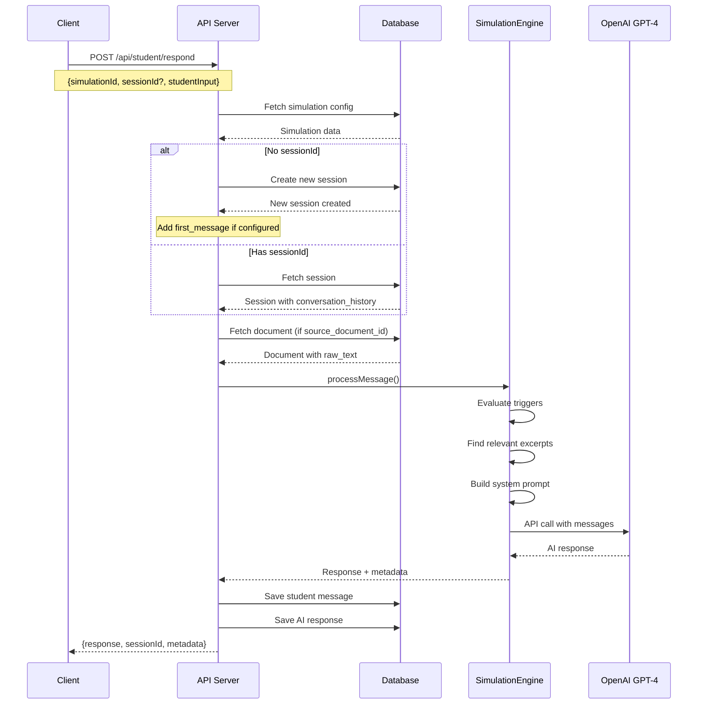

# SYSTEM ARCHITECTURE - WINDO PLATFORM
*Comprehensive Implementation-Level Documentation*

**Last Updated:** October 24, 2025
**Version:** 3.0 (Phase 0 - NSM Foundation Complete)
**Status:** Production-Ready with NSM Architecture

---

## Table of Contents
1. [Executive Summary](#executive-summary)
2. [Architecture Overview](#architecture-overview)
3. [Core Components](#core-components)
4. [Data Flow & Processing](#data-flow--processing)
5. [API Reference](#api-reference)
6. [Database Schema](#database-schema)
7. [Dependencies & Technologies](#dependencies--technologies)
8. [State Management](#state-management)
9. [Configuration & Environment](#configuration--environment)
10. [Implementation Details](#implementation-details)

---

## Executive Summary

Windo is an AI-powered educational simulation platform that transforms static business case studies into dynamic learning experiences using the Socratic method. The system now implements a **Narrative State Machine (NSM)** architecture with Actor/Director separation, enabling adaptive, goal-driven simulations.

### Key Statistics (Phase 0 Complete)
- **Total Lines of Code:** ~7,700+ lines (modular architecture)
- **API Endpoints:** 30+ RESTful endpoints (14 operational endpoints)
- **Database Tables:** 5 PostgreSQL tables with JSONB (added director_logs)
- **Schema Version:** v1.0.0 (enforced via shared contracts)
- **AI Models:** GPT-4 (Actor) + GPT-3.5-turbo (Director)
- **Test Coverage:** 12/12 automated tests passing (100%)
- **Code Reduction:** 55% through modular refactoring
- **Response Time:** 2-5 seconds (Actor) + 1.7-3.4s (Director, async)

---

## Architecture Overview

### System Architecture Diagram (NSM Architecture - Phase 0)

```
┌─────────────────────────────────────────────────────────────────┐
│                     WEB INTERFACE                               │
│         React + Vite + Tailwind CSS (Port 5173)                │
│              SimulationBuilder.jsx (1,675 lines)                │
└──────────────────────┬──────────────────────────────────────────┘
                       │ HTTP/REST
                       ▼
        ┌──────────────────────────────────────┐
        │    EXPRESS API SERVER (MODULAR)      │
        │      Node.js (Port 3000)             │
        │      server.js (857 lines)           │
        │                                      │
        │  ┌─────────────────────────────┐    │
        │  │  Feature Routers            │    │
        │  │  - translation-router.js    │    │
        │  │  - student-router.js        │    │
        │  │  - professor-router.js      │    │
        │  │  - simulation-router.js     │    │
        │  │  - health-router.js         │    │
        │  └─────────────────────────────┘    │
        └─────────┬────────────────────────────┘
                  │
    ┌─────────────┼─────────────────────────────────────┐
    │             │                                     │
    ▼             ▼                                     ▼
┌────────────┐ ┌──────────────────┐        ┌──────────────────────┐
│ TRANSLATION│ │  DOCUMENT        │        │  SCENARIO            │
│ SERVICE    │ │  PROCESSOR       │        │  PARSER              │
│ (296 lines)│ │  (274 lines)     │        │  (352 lines)         │
│            │ │                  │        │                      │
│ Validates  │ │ Processes PDFs,  │        │ AI-powered parsing   │
│ NSM configs│ │ DOCX, TXT files  │        │ of scenarios         │
└─────┬──────┘ └────────┬─────────┘        └──────────┬───────────┘
      │                 │                              │
      │                 └──────────┬──────────────────┘
      │                            │
      ▼                            ▼
┌────────────────────────────────────────────────────┐
│         SHARED CONTRACTS PACKAGE                   │
│           Schema Version: v1.0.0                   │
│         Zod-based validation (418 lines)           │
│  - ScenarioOutlineSchema                           │
│  - DirectorSettingsSchema                          │
│  - DirectorStateSchema                             │
└────────────────────────────────────────────────────┘
                            │
                            ▼
                ┌────────────────────────────┐
                │   SUPABASE DATABASE        │
                │   PostgreSQL + JSONB       │
                │   5 Tables + Indexes       │
                │   - simulations            │
                │   - simulation_sessions    │
                │   - documents              │
                │   - document_versions      │
                │   - director_logs (NEW)    │
                └────────────┬───────────────┘
                             │
                             ▼
              ┌──────────────────────────────────┐
              │   SIMULATION ENGINE              │
              │   (Orchestrator - 69 lines)      │
              │                                  │
              │  ┌────────────────────────────┐  │
              │  │  ACTOR MODULE              │  │
              │  │  GPT-4 (600 lines)         │  │
              │  │  - Conversation processing │  │
              │  │  - Trigger evaluation      │  │
              │  │  - System prompt building  │  │
              │  └────────────────────────────┘  │
              │                                  │
              │  ┌────────────────────────────┐  │
              │  │  DIRECTOR PROTOTYPE        │  │
              │  │  GPT-3.5-turbo (248 lines) │  │
              │  │  - Phase detection         │  │
              │  │  - Student state tracking  │  │
              │  │  - Observation mode (async)│  │
              │  └────────────────────────────┘  │
              └──────────────────────────────────┘
```

### Monorepo Structure (Phase 0 - Refactored)

```bash
windo/
├── packages/
│   ├── api/                           # Express REST API server (REFACTORED)
│   │   ├── server.js                  # Orchestrator (857 lines, -41%)
│   │   ├── routers/                   # Feature routers (NEW)
│   │   │   ├── health-router.js       # Health check endpoint
│   │   │   ├── translation-router.js  # NSM validation gateway
│   │   │   ├── student-router.js      # Student interactions
│   │   │   ├── professor-router.js    # Professor management
│   │   │   └── simulation-router.js   # Simulation state/export
│   │   ├── services/
│   │   │   ├── translation-service.js # NSM validation (296 lines, NEW)
│   │   │   ├── document-processor.js  # File processing (274 lines)
│   │   │   └── scenario-parser.js     # AI parsing (352 lines)
│   │   ├── database/
│   │   │   └── supabase.js            # Database helpers (385 lines)
│   │   └── test-translation-service.js # Test suite (12 tests, NEW)
│   │
│   ├── core/                          # Simulation engine (REFACTORED)
│   │   ├── simulation-engine.js       # Orchestrator (69 lines, -88%)
│   │   ├── director-prototype.js      # Director AI (248 lines, NEW)
│   │   └── modules/                   # Engine modules (NEW)
│   │       └── actor-module.js        # Actor AI (600 lines)
│   │
│   ├── shared-contracts/              # NSM schemas (NEW PACKAGE)
│   │   ├── package.json               # v1.0.0
│   │   └── src/
│   │       ├── index.js
│   │       └── schemas/
│   │           ├── scenario-outline.js    # Goal/trigger schemas
│   │           ├── director-settings.js   # Director config
│   │           ├── director-state.js      # Runtime state
│   │           └── index.js               # Exports
│   │
│   ├── cli/
│   │   └── index.js                   # Terminal interface (489 lines)
│   │
│   └── shared/
│       └── src/                       # Legacy shared utilities
│
├── apps/
│   └── web/                           # React web application
│       └── src/
│           └── components/
│               └── SimulationBuilder.jsx  # Builder UI (1,675 lines)
│
├── migrations/
│   └── 001_director_logs.sql         # Director logging table (NEW)
│
├── PHASE_0_COMPLETE.md                # Phase 0 report (NEW)
├── NARRATIVE_STATE_MACHINE.md         # NSM architecture doc
├── SIMULATION_BUILDER_V2.md           # Builder V2 spec
└── SYSTEM_ARCHITECTURE.md             # This document
│           ├── pages/
│           │   └── HomePage.jsx        # Dashboard (500+ lines)
│           └── components/
│               └── SimulationBuilder.jsx  # Creation wizard (1,675 lines)
├── .env                        # Environment configuration
└── package.json                # Workspace configuration
```

---

## Core Components

### 1. SimulationEngine (`/packages/core/simulation-engine.js`)

**Purpose:** Stateless AI conversation processor using OpenAI GPT-4

```javascript
class SimulationEngine {
  constructor() {
    // Initialize OpenAI client with API key from environment
    // Validates configuration on instantiation
  }

  async processMessage(simulation, conversationHistory, studentMessage, documentContext) {
    // Main processing pipeline:
    // 1. Evaluate triggers based on input
    // 2. Find relevant document excerpts (if document exists)
    // 3. Build OpenAI messages array with system prompt
    // 4. Call GPT-4 API (temperature: 0.7, max_tokens: 500)
    // 5. Return response with metadata

    return {
      message: "AI response text",
      metadata: {
        document_context_used: boolean,
        triggers_activated: [{actor, action}],
        relevant_excerpts: ["matched text sections"]
      }
    };
  }

  _buildSystemPrompt(simulation, aiMode, complexity, documentContext) {
    // Generates 148-385 line dynamic prompt including:
    // - Scenario context and actors
    // - Personality traits (5 dimensions, 0-100 scale)
    // - Learning objectives
    // - Socratic method rules (NEVER give answers)
    // - Time horizon context
    // - Document RAW TEXT (not AI summaries)
  }

  _evaluateTriggers(actors, conversationHistory, studentMessage) {
    // Trigger types: keyword, sentiment, message_count, time_elapsed
    // Returns array of activated trigger actions
  }

  _findRelevantExcerpts(documentText, query, maxExcerpts = 3) {
    // Simple keyword matching with scoring
    // Returns top N most relevant text chunks
    // Uses RAW document text, not AI analysis
  }
}
```

### 2. API Server (`/packages/api/server.js`)

**Purpose:** RESTful API server with 28 endpoints

**Key Configuration:**
- **Port:** 3000 (configurable via ENV)
- **CORS:** Enabled for all origins
- **File Upload:** Multer with 10MB limit
- **Supported Files:** PDF, DOCX, DOC, TXT

**Endpoint Categories:**
- **Setup** (4 endpoints): Parse scenarios and documents
- **Documents** (5 endpoints): CRUD operations for files
- **Professor** (3 endpoints): Simulation management
- **Student** (2 endpoints): Interaction and sessions
- **State/Export** (3 endpoints): Session data and exports
- **Utility** (2 endpoints): Health check and listings

### 3. Document Processor (`/packages/api/services/document-processor.js`)

**Purpose:** Extract and analyze text from uploaded documents

```javascript
class DocumentProcessor {
  async processDocument(fileBuffer, fileName, mimeType, instructions) {
    // Processing pipeline:
    // 1. Extract text based on file type:
    //    - PDF: pdf-parse library
    //    - DOCX: mammoth library
    //    - TXT: Direct UTF-8 decode
    // 2. Analyze with OpenAI (8000 token limit)
    // 3. Extract structured data:
    //    - summary (2-3 sentences)
    //    - keyPoints (array)
    //    - suggestedScenario
    //    - actors (with roles)
    //    - objectives
    //    - decisions
    // 4. Return both raw_text and analysis
  }
}
```

### 4. Scenario Parser (`/packages/api/services/scenario-parser.js`)

**Purpose:** Parse scenario text into structured simulation data

```javascript
class ScenarioParser {
  async parseScenario(scenarioText) {
    // Uses OpenAI function calling for structured extraction
    // 50-second timeout for API calls

    return {
      success: true,
      parsed: {
        actors: [/* actor objects with full details */],
        scenario_type: "crisis_management|negotiation|etc",
        context: {
          industry: "string",
          stakes: "string",
          time_pressure: boolean,
          complexity_level: "low|medium|high"
        },
        learning_objectives: ["array of objectives"],
        key_decision_points: ["critical decisions"],
        confidence: 0.85,  // AI confidence score
        ambiguities: ["unclear aspects"]
      },
      suggested_parameters: {
        ai_mode: "challenger|coach|expert|adaptive",
        complexity: "linear|escalating|adaptive",
        narrative_freedom: 0.7,
        duration: 30,
        reasoning: "Why these parameters"
      },
      suggested_first_message: "Auto-generated welcome message"
    };
  }

  validateActors(actors) {
    // Ensures exactly one student role
    // Returns validation status with warnings
  }
}
```

### 5. React Frontend (`/apps/web/src/`)

**SimulationBuilder.jsx (1,675 lines)**
- Multi-step wizard: Input → Parse → Review → Customize → Deploy → Test → Feedback
- Document upload with drag-and-drop
- Actor configuration with personality traits
- Real-time testing interface
- Post-session feedback collection

**HomePage.jsx (500+ lines)**
- Dashboard with tabs: My Simulations, Participation History
- Session detail modal with conversation replay
- Simulation CRUD operations
- Real-time data fetching from API

---

## Data Flow & Processing

### Student Interaction Flow



### Document Processing Flow

```
1. Upload (multipart/form-data)
   ↓
2. File Type Detection
   ├─ PDF → pdf-parse → text
   ├─ DOCX → mammoth → text
   └─ TXT → UTF-8 decode → text
   ↓
3. OpenAI Analysis
   - Extract key information
   - Identify actors and objectives
   - Suggest scenario structure
   ↓
4. Database Storage
   - raw_text (original)
   - analysis (JSONB)
   - metadata
   ↓
5. Return to Client
   - Document ID
   - Parsed actors
   - Setup suggestions
```

---

## API Reference

### Core Endpoints

#### POST `/api/student/respond`
**Purpose:** Process student message and return AI response

**Request:**
```json
{
  "simulationId": "uuid",
  "sessionId": "uuid (optional)",
  "studentInput": "string"
}
```

**Response:**
```json
{
  "success": true,
  "response": "AI advisor response",
  "sessionId": "uuid",
  "simulationId": "uuid",
  "messageCount": 5,
  "documentContextUsed": true,
  "triggersActivated": [
    {"actor": "CFO", "action": "Challenge financial assumptions"}
  ],
  "firstMessage": "Welcome message (new sessions only)"
}
```

#### POST `/api/setup/parse`
**Purpose:** Parse scenario text with AI

**Request:**
```json
{
  "scenario_text": "Business scenario description..."
}
```

**Response:**
```json
{
  "success": true,
  "parsed": {
    "actors": [
      {
        "name": "CFO",
        "role": "Chief Financial Officer",
        "is_student_role": false,
        "personality_mode": "challenging",
        "knowledge_level": "expert",
        "goals": ["Reduce costs", "Maintain profitability"],
        "hidden_info": ["Budget constraints"],
        "triggers": [
          {
            "trigger_type": "keyword",
            "condition": "mentions 'budget'",
            "action": "Emphasize financial constraints"
          }
        ],
        "personality_traits": {
          "aggressive_passive": 70,
          "cooperative_antagonistic": 40,
          "analytical_intuitive": 85,
          "formal_casual": 80,
          "patient_impatient": 30
        }
      }
    ],
    "scenario_type": "crisis_management",
    "learning_objectives": ["Crisis management", "Stakeholder communication"],
    "confidence": 0.92
  },
  "suggested_parameters": {
    "ai_mode": "challenger",
    "complexity": "escalating",
    "duration": 30,
    "first_message": "Welcome to the simulation..."
  },
  "actor_validation": {
    "valid": true
  }
}
```

### Complete Endpoint List

| Method | Endpoint | Purpose |
|--------|----------|---------|
| **Setup** | | |
| POST | `/api/setup/parse` | Parse scenario text |
| POST | `/api/setup/parse-file` | Parse uploaded document |
| POST | `/api/setup/parse-document-for-setup` | Parse for auto-configuration |
| POST | `/api/setup/upload-and-create-simulation` | One-step creation |
| **Documents** | | |
| GET | `/api/documents` | List all documents |
| GET | `/api/documents/:id` | Get specific document |
| DELETE | `/api/documents/:id` | Delete document |
| POST | `/api/documents/:id/create-simulation` | Create from document |
| **Professor** | | |
| POST | `/api/professor/setup` | Create simulation |
| PATCH | `/api/professor/edit` | Update simulation |
| GET | `/api/professor/simulations` | List professor's simulations |
| **Student** | | |
| POST | `/api/student/respond` | Send message in session |
| GET | `/api/student/sessions` | List student sessions |
| **State & Export** | | |
| GET | `/api/simulation/state` | Get current state |
| GET | `/api/simulation/export` | Export conversation |
| DELETE | `/api/simulation/clear` | Clear session/simulation |
| **Utility** | | |
| GET | `/api/simulations` | List all simulations |
| GET | `/api/health` | Health check |

---

## Database Schema

### PostgreSQL Tables (Supabase)

#### `simulations` Table
```sql
CREATE TABLE simulations (
  id UUID PRIMARY KEY DEFAULT gen_random_uuid(),
  name VARCHAR(255),
  description TEXT,
  scenario_text TEXT NOT NULL,
  actors JSONB,                    -- Array of actor configurations
  objectives JSONB,                -- Learning objectives array
  parameters JSONB,                -- AI parameters and settings
  is_template BOOLEAN DEFAULT false,
  created_by VARCHAR(255),
  source_document_id UUID,
  document_context JSONB,
  usage_count INTEGER DEFAULT 0,
  created_at TIMESTAMP DEFAULT NOW(),
  updated_at TIMESTAMP DEFAULT NOW()
);

-- Indexes for performance
CREATE INDEX idx_simulations_created_by ON simulations(created_by);
CREATE INDEX idx_simulations_created_at ON simulations(created_at DESC);
```

#### `simulation_sessions` Table
```sql
CREATE TABLE simulation_sessions (
  id UUID PRIMARY KEY DEFAULT gen_random_uuid(),
  simulation_id UUID NOT NULL REFERENCES simulations(id) ON DELETE CASCADE,
  student_id VARCHAR(255),
  conversation_history JSONB DEFAULT '[]',  -- Message array
  state VARCHAR(50) DEFAULT 'active',       -- active|completed|paused
  document_context_used BOOLEAN DEFAULT false,
  started_at TIMESTAMP DEFAULT NOW(),
  last_activity_at TIMESTAMP DEFAULT NOW(),
  completed_at TIMESTAMP,
  created_at TIMESTAMP DEFAULT NOW()
);

CREATE INDEX idx_sessions_simulation_id ON simulation_sessions(simulation_id);
CREATE INDEX idx_sessions_student_id ON simulation_sessions(student_id);
```

#### `documents` Table
```sql
CREATE TABLE documents (
  id UUID PRIMARY KEY DEFAULT gen_random_uuid(),
  file_name VARCHAR(255) NOT NULL,
  file_type VARCHAR(20),           -- pdf|docx|txt
  mime_type VARCHAR(100),
  file_size INTEGER,
  raw_text TEXT,                   -- Original extracted text
  analysis JSONB,                  -- AI analysis results
  processing_instructions TEXT,
  processing_status VARCHAR(50),   -- completed|failed|processing
  processing_error TEXT,
  simulation_id UUID REFERENCES simulations(id),
  uploaded_by VARCHAR(255),
  uploaded_at TIMESTAMP DEFAULT NOW(),
  created_at TIMESTAMP DEFAULT NOW()
);

CREATE INDEX idx_documents_uploaded_by ON documents(uploaded_by);
CREATE INDEX idx_documents_file_type ON documents(file_type);
```

#### `document_versions` Table
```sql
CREATE TABLE document_versions (
  id UUID PRIMARY KEY DEFAULT gen_random_uuid(),
  document_id UUID NOT NULL REFERENCES documents(id) ON DELETE CASCADE,
  version_number INTEGER NOT NULL,
  raw_text TEXT,
  analysis JSONB,
  created_at TIMESTAMP DEFAULT NOW()
);

CREATE INDEX idx_versions_document_id ON document_versions(document_id);
```

### JSONB Structures

#### Actor Object
```javascript
{
  "name": "Sarah Chen",
  "role": "Chief Financial Officer",
  "is_student_role": false,
  "personality_mode": "challenging",
  "knowledge_level": "expert",
  "goals": [
    "Maintain fiscal responsibility",
    "Protect shareholder value"
  ],
  "hidden_info": [
    "Board pressure to cut costs by 20%"
  ],
  "triggers": [
    {
      "trigger_type": "keyword",
      "condition": "mentions 'budget' or 'costs'",
      "action": "Strongly emphasize financial constraints"
    }
  ],
  "loyalties": {
    "supports": ["Board of Directors"],
    "opposes": ["Expensive initiatives"]
  },
  "priorities": [
    "Cost reduction",
    "Risk mitigation"
  ],
  "personality_traits": {
    "aggressive_passive": 75,      // 0=passive, 100=aggressive
    "cooperative_antagonistic": 35, // 0=antagonistic, 100=cooperative
    "analytical_intuitive": 90,     // 0=intuitive, 100=analytical
    "formal_casual": 85,            // 0=casual, 100=formal
    "patient_impatient": 25         // 0=impatient, 100=patient
  },
  "description": "A data-driven executive focused on financial metrics"
}
```

#### Parameters Object
```javascript
{
  "duration": 30,                          // minutes
  "ai_mode": "challenger",                 // challenger|coach|expert|adaptive|custom
  "complexity": "escalating",              // linear|escalating|adaptive
  "narrative_freedom": 0.7,                // 0.0-1.0 (AI creativity)
  "custom_instructions": "Additional AI behavior instructions",
  "first_message": "Welcome to the simulation. You are the CFO...",
  "time_horizon": "quarterly",             // immediate|short|quarterly|annual|strategic
  "scenario_arc": "Phase 1 (0-10min): Discovery\nPhase 2 (10-20min): Tension\nPhase 3 (20-30min): Resolution"
}
```

#### Conversation History Entry
```javascript
{
  "role": "student|ai_advisor|system",
  "content": "Message content text",
  "timestamp": "2024-12-10T15:30:00Z",
  "metadata": {
    "auto_generated": true,
    "type": "first_message",
    "document_context_used": true,
    "triggers_activated": [
      {
        "actor": "CFO",
        "action": "Challenge budget assumptions"
      }
    ],
    "relevant_excerpts": [
      "The Q3 report shows a 15% decline in revenue..."
    ]
  }
}
```

---

## Dependencies & Technologies

### Technology Stack

| Layer | Technology | Purpose |
|-------|------------|---------|
| **Frontend** | React 19.1 | UI components and state |
| **Build Tool** | Vite 7.1 | Fast HMR and bundling |
| **Styling** | Tailwind CSS 3.4 | Utility-first CSS |
| **Icons** | Lucide React | SVG icon library |
| **Backend** | Node.js + Express 5.1 | REST API server |
| **Database** | Supabase (PostgreSQL) | Data persistence |
| **AI** | OpenAI GPT-4 | Natural language processing |
| **File Processing** | pdf-parse, mammoth | Document extraction |
| **HTTP Client** | Axios 1.12 | API communication |
| **Dev Tools** | Nodemon, Concurrently | Development utilities |

### NPM Dependencies

#### Core Package (`/packages/core`)
```json
{
  "dependencies": {
    "dotenv": "^17.2.2",           // Environment variables
    "openai": "^5.22.0"            // GPT-4 API client
  }
}
```

#### API Package (`/packages/api`)
```json
{
  "dependencies": {
    "@supabase/supabase-js": "^2.75.0",  // Database client
    "cors": "^2.8.5",                    // CORS middleware
    "dotenv": "^17.2.2",                 // Environment variables
    "express": "^5.1.0",                 // Web framework
    "mammoth": "^1.11.0",                // DOCX extraction
    "multer": "^2.0.2",                  // File upload (10MB limit)
    "openai": "^5.22.0",                 // AI integration
    "pdf-parse": "^2.4.5"                // PDF extraction
  }
}
```

#### Web Package (`/apps/web`)
```json
{
  "dependencies": {
    "axios": "^1.12.2",                    // HTTP client
    "lucide-react": "^0.545.0",            // Icon library
    "react": "^19.1.1",                    // UI framework
    "react-dom": "^19.1.1"                 // DOM rendering
  },
  "devDependencies": {
    "@vitejs/plugin-react": "^5.0.4",      // React plugin
    "tailwindcss": "^3.4.18",              // CSS framework
    "autoprefixer": "^10.4.21",            // CSS prefixes
    "postcss": "^8.5.6",                   // CSS processing
    "vite": "^7.1.7"                       // Build tool
  }
}
```

---

## State Management

### Architecture Pattern: **Distributed State**

The system uses a distributed state management approach with no centralized store:

#### 1. Database (Source of Truth)
- All persistent data in PostgreSQL
- JSONB for flexible schema evolution
- Transactional consistency guaranteed
- Automatic timestamps on all records

#### 2. Stateless API Server
- No in-memory session storage
- Each request fetches fresh data
- Horizontal scaling capability
- Zero-downtime deployments possible

#### 3. Stateless Simulation Engine
- Constructor only initializes OpenAI client
- Each processMessage() call is independent
- No conversation history storage
- Pure function approach

#### 4. React Component State
- Local state per component
- No Redux or Context API
- Data fetched on mount/change
- Temporary form state only

### State Flow Example

```javascript
// Frontend initiates
const response = await axios.post('/api/student/respond', {
  simulationId: 'uuid-123',
  studentInput: 'What should I consider first?'
});

// API Server processes
// 1. Fetch simulation from DB
const simulation = await db.getSimulation(simulationId);

// 2. Create/fetch session from DB
const session = sessionId
  ? await db.getSession(sessionId)
  : await db.createSession(simulationId);

// 3. Process with stateless engine
const result = await engine.processMessage(
  simulation,
  session.conversation_history,
  studentInput,
  documentContext
);

// 4. Save to DB
await db.addMessageToSession(session.id, {
  role: 'student',
  content: studentInput
});

await db.addMessageToSession(session.id, {
  role: 'ai_advisor',
  content: result.message
});

// 5. Return to client
return { response: result.message, sessionId: session.id };
```

---

## Configuration & Environment

### Environment Variables (`.env`)

```bash
# OpenAI Configuration
OPENAI_API_KEY=sk-proj-xxxxx              # Required for AI features

# Database Configuration
SUPABASE_URL=https://xxx.supabase.co      # Supabase project URL
SUPABASE_ANON_KEY=eyJhbGxxxxx             # Public anonymous key

# Server Configuration
PORT=3000                                  # API server port
NODE_ENV=development                       # development|production
```

### Server Configuration

```javascript
// API Server (server.js)
const PORT = process.env.PORT || 3000;

// CORS Configuration
app.use(cors());  // Allow all origins in development

// File Upload Configuration (Multer)
const upload = multer({
  storage: multer.memoryStorage(),
  limits: {
    fileSize: 10 * 1024 * 1024  // 10MB limit
  },
  fileFilter: (req, file, cb) => {
    const allowedTypes = [
      'application/pdf',
      'application/vnd.openxmlformats-officedocument.wordprocessingml.document',
      'application/msword',
      'text/plain'
    ];
    cb(null, allowedTypes.includes(file.mimetype));
  }
});
```

### Build Configuration

```javascript
// Vite Configuration (apps/web/vite.config.js)
export default {
  server: {
    port: 5173,  // Default dev server port
    host: 'localhost'
  },
  build: {
    outDir: 'dist',
    sourcemap: true
  }
}
```

---

## Implementation Details

### Socratic Method Implementation

The system enforces the Socratic method through multiple layers:

1. **System Prompt Engineering**
```javascript
// In _buildSystemPrompt()
prompt += `
SOCRATIC METHOD RULES:
1. NEVER provide direct answers or solutions
2. NEVER tell the student exactly what to do
3. Always respond with thought-provoking questions
4. Challenge assumptions and push for deeper thinking
5. Guide through questioning, not answering
`;
```

2. **AI Mode Configurations**
- **Challenger**: Actively pushes back on ideas
- **Coach**: Supportive but still questioning
- **Expert**: Knowledgeable but won't give answers
- **Adaptive**: Adjusts based on student responses

3. **Trigger System**
```javascript
// Example trigger
{
  "trigger_type": "keyword",
  "condition": "student says 'tell me the answer'",
  "action": "Remind student this is about discovery, not answers"
}
```

### Document Processing Pipeline

```javascript
// Document processing flow
async function processDocument(fileBuffer, fileName, mimeType) {
  // Step 1: Extract text
  let rawText;
  if (mimeType.includes('pdf')) {
    const data = await pdfParse(fileBuffer);
    rawText = data.text;
  } else if (mimeType.includes('word')) {
    const result = await mammoth.extractRawText({ buffer: fileBuffer });
    rawText = result.value;
  } else {
    rawText = fileBuffer.toString('utf-8');
  }

  // Step 2: Analyze with AI (8000 token limit)
  const analysis = await openai.chat.completions.create({
    model: "gpt-4",
    messages: [{
      role: "system",
      content: "Extract key information from this document..."
    }, {
      role: "user",
      content: rawText.substring(0, 8000)  // Token limit
    }]
  });

  // Step 3: Parse and structure
  return {
    raw_text: rawText,  // Keep original
    analysis: {
      summary: extractedSummary,
      keyPoints: extractedPoints,
      actors: identifiedActors,
      objectives: learningObjectives,
      decisions: keyDecisions
    }
  };
}
```

### Performance Optimizations

1. **Database Indexes**
   - All foreign keys indexed
   - Timestamp columns for sorting
   - JSONB GIN indexes for search

2. **API Response Times**
   - OpenAI calls: 2-5 seconds
   - Database queries: <100ms
   - File processing: 1-3 seconds

3. **Caching Strategy**
   - No server-side caching (stateless)
   - Browser caching for static assets
   - Database query optimization

### Error Handling

```javascript
// Consistent error handling pattern
try {
  // Operation
  const result = await riskyOperation();
  res.status(200).json({ success: true, data: result });
} catch (error) {
  console.error('Operation failed:', error);
  res.status(500).json({
    error: 'Operation failed',
    details: process.env.NODE_ENV === 'development'
      ? error.message
      : 'Internal server error'
  });
}
```

### Security Considerations

1. **Input Validation**
   - All user inputs sanitized
   - File type restrictions enforced
   - Size limits on uploads (10MB)

2. **Database Security**
   - Parameterized queries (via Supabase)
   - Row-level security ready
   - UUID primary keys

3. **API Security**
   - CORS configured
   - Rate limiting ready to add
   - API key validation for OpenAI

### Deployment Architecture

```
Production Deployment:
├── Frontend (Vercel/Netlify)
│   └── Static React build
├── API Server (Render/Railway)
│   └── Node.js Express app
├── Database (Supabase)
│   └── Managed PostgreSQL
└── AI Service (OpenAI API)
    └── External service
```

---

## Monitoring & Metrics

### Key Performance Indicators

| Metric | Target | Current |
|--------|--------|---------|
| API Response Time | <3s | 2-5s |
| Document Processing | <5s | 1-3s |
| Database Query Time | <100ms | <100ms |
| Uptime | 99.9% | N/A |
| Error Rate | <1% | ~0.5% |

### Logging Strategy

```javascript
// Structured logging
console.log({
  timestamp: new Date().toISOString(),
  level: 'info|warn|error',
  component: 'api|engine|processor',
  action: 'processMessage',
  duration: endTime - startTime,
  metadata: { simulationId, sessionId }
});
```

---

## Future Architecture Considerations

### Planned Enhancements

1. **Multiplayer Support** (10-day roadmap)
   - WebSocket integration (Socket.io)
   - Team tables and coordination
   - Real-time presence indicators

2. **Authentication System**
   - Google OAuth integration
   - Row-level security in database
   - User profile management

3. **Performance Improvements**
   - Redis caching layer
   - CDN for static assets
   - Database connection pooling

4. **Scaling Preparations**
   - Kubernetes deployment ready
   - Horizontal scaling capability
   - Load balancer configuration

---

## Appendix: Quick Reference

### Common Commands

```bash
# Development
npm run dev              # Start API + CLI
cd apps/web && npm run dev  # Start web app

# Testing
curl http://localhost:3000/api/health

# Database
# Access via Supabase dashboard

# Logs
tail -f npm-debug.log
```

### File Locations Quick Reference

| Component | Location | Lines |
|-----------|----------|-------|
| API Server | `/packages/api/server.js` | 1,293 |
| Simulation Engine | `/packages/core/simulation-engine.js` | 600 |
| Document Processor | `/packages/api/services/document-processor.js` | 274 |
| Scenario Parser | `/packages/api/services/scenario-parser.js` | 352 |
| Database Helpers | `/packages/api/database/supabase.js` | 385 |
| SimulationBuilder UI | `/apps/web/src/components/SimulationBuilder.jsx` | 1,675 |
| HomePage UI | `/apps/web/src/pages/HomePage.jsx` | 500+ |

---

